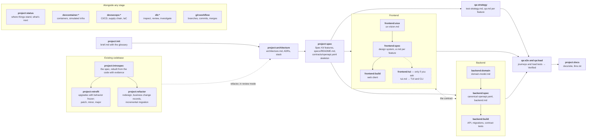
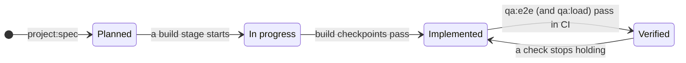

# ai-gent

Skills and plugins for [Claude Code](https://code.claude.com/docs/en/overview) and [opencode](https://opencode.ai/v2/docs), kept in one repository and linked into place, so there's one place to edit.

They cover the whole path of a software project, from idea to docs site, plus the tooling around it:

- **A product pipeline:** brief → architecture → specs → frontend, backend and QA → docs. There are also stages for existing codebases.
- **Container-first development environments.**
- **CI/CD and supply-chain security.**
- **Safe database access.**
- **git rules**, enforced by a hook.

## Install / update

```bash
curl -fsSL https://raw.githubusercontent.com/lucasvmigotto/ai-gent/HEAD/install.sh | sh
```

That clones the repository into `~/.local/share/ai-gent` and runs `setup.sh` for Claude Code and opencode. Run the same command again to update. It fast-forwards the clone, or leaves it alone if you have local changes, and re-links.

Pass `setup.sh` flags after `-s --`, and choose where the clone lives with `AI_GENT_DIR`:

```bash
curl -fsSL https://raw.githubusercontent.com/lucasvmigotto/ai-gent/HEAD/install.sh | sh -s -- --target claude
curl -fsSL https://raw.githubusercontent.com/lucasvmigotto/ai-gent/HEAD/install.sh | AI_GENT_DIR=~/codes/ai-gent sh
```

| Variable | Default |
| --: | :-- |
| `AI_GENT_DIR` | `${XDG_DATA_HOME:-~/.local/share}/ai-gent` |
| `AI_GENT_REPO` | `https://github.com/lucasvmigotto/ai-gent.git` |
| `AI_GENT_BRANCH` | the repository's default branch; a release tag (`1.2.0`) pins that release |

A pinned clone stays on its tag until you pass another one, or the default branch's name to follow it again. Releases are listed in `CHANGELOG.md`.

> [!TIP]
> Piping a script into `sh` runs it unseen. To read it first, download, inspect, then run:

> ```bash
> curl -fsSLo install.sh https://raw.githubusercontent.com/lucasvmigotto/ai-gent/HEAD/install.sh
> less install.sh && sh install.sh
> ```

Or clone it yourself:

```bash
git clone https://github.com/lucasvmigotto/ai-gent.git ~/codes/ai-gent
~/codes/ai-gent/setup.sh
```

### `setup.sh`

Re-run it after adding, renaming or removing a skill or plugin, or after changing a plugin skill's description. It's idempotent, and it prunes whatever it installed whose source is gone. Edits to skill bodies need no re-run, since everything points straight at this repository.

> [!NOTE]
> Claude Code and opencode read the set of skills and hooks when a session starts. After running `setup.sh`, start a new session.

| Flag | Effect |
| --: | :-- |
| `--target claude\|opencode\|all` | which tool to install for (default `all`; opencode is skipped when not installed) |
| `--dry-run` | show what would change |
| `--force` | back up (`<name>.bak-<timestamp>`) and replace a real directory or foreign symlink in the way |
| `--uninstall` | remove everything the script installed for the target(s) |

`CLAUDE_SKILLS_DIR`, `OPENCODE_SKILLS_DIR` and `OPENCODE_COMMANDS_DIR` override the target directories. `~/.claude/skills/synced/` is managed by [claude.ai](https://support.claude.com/en/collections/14445694-claude-code) skill sync and is never modified.

**Claude Code.** Each `plugins/<name>/` (and any `skills/<name>/`) is symlinked into `~/.claude/skills/`. A plugin directory there loads as `<name>@skills-dir`, with no marketplace, install step or plugin cache involved. Check a plugin, including its token cost, with `claude plugin details <name>@skills-dir`.

**opencode.** opencode has no plugin namespaces and requires a skill's name to match its directory. So for each plugin skill, `setup.sh` generates:
- a `~/.config/opencode/skills/<plugin>-<skill>/SKILL.md` stub, with the real description and an instruction to read and follow the source file in this repository;
- a `/<plugin>-<skill>` command in `~/.config/opencode/commands/`.

> [!IMPORTANT]
> opencode also scans `~/.claude/skills` recursively, where plugin skills appear under short, colliding names (`spec`, `build`, …). Turn that off in your shell profile, then check with `opencode debug skill`:
>
> ```bash
> export OPENCODE_DISABLE_CLAUDE_CODE_SKILLS=1
> ```

## Usage

Ask for what you want and the matching skill loads: "set up CI for this repo", "model the domain", "why is this record wrong in the database". Or invoke one directly:

| | Claude Code | opencode |
| --: | :-- | :-- |
| a plugin skill | `/project:init` | `/project-init` |
| with arguments | `/qa:load 2000 concurrent users` | `/qa-load 2000 concurrent users` |

> [!TIP]
> Every enabled plugin's skill descriptions cost context in every session, about 3.1k tokens for all eight plugins together. Turn off the plugins a project doesn't need, for that project only:
>
> ```bash
> claude plugin disable devsecops@skills-dir --scope project   # writes .claude/settings.json
> claude plugin disable qa@skills-dir --scope local            # .claude/settings.local.json, not committed
> ```

## Contents

**Product pipeline**

- `plugins/project/`
  - `init` — idea or references → product brief with the shared glossary
  - `architecture` — drivers and usage volumes → capacity model, topology, hosting, API style, data stores, stack, ADRs
  - `spec` — brief + architecture → Spec Kit constitution, features, plans, tasks and the contract skeleton
  - `status` — where the pipeline stands (artifacts, feature statuses, gaps, contradictions) and the next stage to run
  - `docs` — static documentation site in `docs/site/`, plus `llms.txt` and Markdown pages for LLMs
  - `introspec` — reverse-engineer an existing codebase into the full pipeline spec, every claim Observed, Inferred or Assumed
  - `retrofit` — upgrade in place with behavior frozen: `patch` (CVEs), `minor` (adapt code), `major` (breaking upgrades)
  - `refactor` — redesign keeping the core invariants; business changes recorded for approval; incremental migration
- `plugins/frontend/`
  - `uiux` — layout and language vision
  - `spec` — design system and per-feature UI specs in Spec Kit format
  - `build` — implement the web frontend phase by phase
  - `tui` — terminal interfaces, only when you ask for one: a TUI and the CLI under it, or a CLI alone. Stacks: Go/Bubble Tea, Rust/Ratatui, Python/Textual, Java/Lanterna, TypeScript/Ink, or .NET/Spectre.Console or Terminal.Gui
- `plugins/backend/`
  - `domain` — domain model: contexts, aggregates, invariants, lifecycles
  - `spec` — canonical OpenAPI contract and per-feature backend specs
  - `build` — implement the backend, tests and contract first
- `plugins/qa/`
  - `strategy` — risk-based test strategy, per-feature traceability and gates
  - `e2e` — cross-stack journeys (Playwright; terminal journeys for a TUI or CLI); sets features Verified
  - `load` — k6 load, stress, spike, soak and breakpoint tests from the capacity model
  - `review` — audit an existing test suite (mutation testing, flakiness, gaps)

**Environment and delivery**

- `plugins/devcontainer/` — container-first development (see [Containers](#containers))
  - `setup` — per-module multi-stage Containerfiles with a thin `tools` layer that agents and CI run, task recipes and resource limits, plus devcontainers for people (API and client apart by default)
  - `infra` — simulate databases, queues, storage, SMTP/mail, OAuth2/OIDC/LDAP and more
  - `proxy` — simulate the production reverse proxy
  - `workflow` — run tasks through the tools recipes, or operate the devcontainer day to day
- `plugins/devsecops/` — GitHub Actions by default; GitLab CI, Azure Pipelines, Bitbucket Pipelines, Jenkins, Forgejo/Gitea
  - `pipeline` — design and create CI/CD pipelines, gates, environments and promotion
  - `supply-chain` — pinning, updates, SCA/SAST/secret scanning, hardened images, SBOM, signing, provenance
  - `iac` — infrastructure as code (OpenTofu/Terraform by default) for the environments the architecture chose
  - `audit` — security and reliability review of existing pipelines
  - `migrate` — move pipelines between platforms
- `plugins/db/` — safe database access for PostgreSQL, MySQL/MariaDB, SQL Server, Oracle and SQLite (see [Databases](#databases))
  - `connect` — list, test and classify connection profiles, never showing credentials
  - `inspect` — full discovery of a database: schema, constraints, indexes, routines, links, statistics, ERD
  - `review` — how the project uses its database: mappings vs. schema, migrations, indexes, queries, pooling, rights, backups
  - `investigate` — a scenario and a symptom → hypotheses, evidence, root cause (hand edit vs. application bug), repair
- `plugins/git/`
  - `workflow` — Conventional Commits, branch-per-context naming, merge and cleanup rules, tags, issue linking (see [Guard hooks](#guard-hooks))

## Product pipeline

Each stage writes a file the next one reads, so stages can run in separate sessions or on their own. `shared/pipeline.md` is the contract for paths, ownership, statuses and shared rules.



In plain text: init → architecture → spec → frontend, backend and QA in parallel → e2e and load → docs. For an existing codebase: introspec → retrofit or refactor.

Every feature's status, per side, in `specs/README.md`:



- Documents (brief, architecture, UX vision, domain model) stay `Draft` until you accept them.
- Frontend and backend meet only at `contracts/openapi.yaml` and the brief's glossary.
- Specs use GitHub Spec Kit (`specify` CLI 1.x), set up by `project:spec`.

> [!NOTE]
> `frontend:tui` and every terminal section of the vision and specs appear only when you ask for a terminal interface. No stage adds one on its own.

## Containers

The rules are in `shared/containers.md` and are shared by the devcontainer, devsecops and project plugins.

- **Engines:** Podman first, Docker as fallback, never hardcoded.
- **The `tools` stage** of each module's Containerfile is where agents and CI run every task, through the same recipes (`just test`). The devcontainer for people can be heavier, but it reads its toolchain versions from the same single source.
- **Images:**
  - Docker Hardened Images (`dhi.io`), pinned by digest;
  - multi-stage builds that mount sources and caches instead of copying them;
  - a deny-by-default `.dockerignore`;
  - resource limits on every container.
- Pushes to `ghcr.io` use the workflow's own token, logged in as the repository owner.

> [!IMPORTANT]
> CI needs a `DOCKER_HUB_PAT` secret to pull hardened images from `dhi.io`. Its username comes from the `DOCKER_HUB_USERNAME` variable, which defaults to the repository owner. Locally, log in once with `podman login dhi.io` (or `docker login dhi.io`).

## Databases

Every `db:*` skill reaches a database only through `plugins/db/scripts/dbrun.py`, which enforces `plugins/db/references/safety.md`.

- **Remote databases** are production, staging/homologação, shared development, or anything not proven local. They get `SELECT` only, with timeouts, row caps and cost guards.
- **Local databases** are only this repository's own database containers, running on this machine and reached through the container's own network.
  - A write needs a recorded plan, your confirmation and a backup, and can be restored.
- **Results are masked by default** (names, emails, CPF/CNPJ, phones, cards, secrets) and revealed only when you ask.
- **Every statement is logged before it runs**, outside the repository.

> [!IMPORTANT]
> `dbrun` never executes a write on a remote database, in any environment. A change to one is written as a script, for a person to review and run.

> [!CAUTION]
> A local container restored from a production or staging dump is writable, but its rows are still real personal data. Masking and the logging rules apply exactly as for the source.

Connection profiles live in `~/.config/ai-gent/db/connections.env`: mode 600, format in `plugins/db/references/connections.md`. A running database container of the current project is discovered automatically as `local:<service>`.

## Guard hooks

Two plugins install `PreToolUse` hooks in Claude Code. They enforce their rules mechanically, not just as instructions. They load in a new session after `setup.sh`.

| Hook | Blocks | Asks first |
| --: | :-- | :-- |
| `git` (`plugins/git/hooks/guard.sh`) | `--no-verify`, `Co-Authored-By` trailers, `push --force` without a lease | pushes; commits or merges on `main`/`master`; `branch -D`, `reset --hard`, `clean -f`, `commit --amend`, history rewrites, `gh pr create` |
| `db` (`plugins/db/hooks/guard.sh`) | direct database clients (`psql`, `mysql`, `sqlcmd`, `sqlplus`, `sqlite3`, `mongosh`, …) running SQL that writes; restore tools; any tool reading or editing the credentials file | any other direct client use |

> [!WARNING]
> opencode doesn't run Claude Code hooks, so neither guard is active there. Its permission rules only get part of the way. For example, in `~/.config/opencode/opencode.json`:

> ```json
> {
>   "permission": {
>     "bash": {
>       "git push*": "ask",
>       "git commit*--no-verify*": "deny",
>       "git branch -D*": "ask",
>       "git reset --hard*": "ask",
>       "gh pr create*": "ask",
>       "psql*": "ask",
>       "mysql*": "ask",
>       "sqlcmd*": "ask",
>       "sqlplus*": "ask",
>       "sqlite3*": "ask",
>       "pg_restore*": "deny"
>     }
>   }
> }
> ```

## Layout

```txt
plugins/<name>/.claude-plugin/plugin.json
plugins/<name>/skills/<skill>/SKILL.md          a plugin skill                    → /<name>:<skill>
plugins/<name>/skills/<skill>/references/       files one skill reads on demand
plugins/<name>/references/                      files a plugin's skills share
plugins/<name>/hooks/                           guard hooks (git, db)
plugins/<name>/scripts/                         tools a plugin runs (db: dbrun)
plugins/<name>/evals/                           trigger and behavior evals
skills/<name>/SKILL.md                          personal skills (none yet)        → /<name>
shared/                                         pipeline and container rules, symlinked into plugins' references/
scripts/                                        check.sh, release.py and their tests
.github/workflows/                              check (pull requests), release (pushes to main)
```

## Development

Conventions for editing skills and plugins are in `AGENTS.md` (also available as `CLAUDE.md`).

**Checks.** Run `scripts/check.sh` before committing; CI runs the same script.
- **Metadata:** skill names and description budgets (400 characters, since every session loads them), and plugin manifests.
- **References:** `plugin:skill` references, relative paths and symlinks.
- **Scripts:** shell scripts through shellcheck.
- **Tests:** the git and db guards, `dbrun` (its statement classifier, masking and SQLite end-to-end paths), the release script, and the installers in a throwaway `HOME`.
- **Options:** `--quick` skips the installer tests. Shellcheck runs at a pinned version (`SHELLCHECK_VERSION`) through `uvx` or `pipx`, so a local run and CI agree.

**Evals.** `claude plugin eval plugins/<name> --runs 1 --ablation none` runs a plugin's trigger cases. They check that a request loads the right skill and not its neighbor.

> [!NOTE]
> Eval runs cost real tokens, so they aren't part of CI.

Behavior cases that need a shell also need `--scaffold --allow-tools Bash` and the eval sandbox's dependencies (`bubblewrap`, `socat`).

**Releases are automatic.** Every push to `main` runs the checks. Then `scripts/release.py` decides from the Conventional Commits since the last tag:
- `feat` → minor;
- `fix`, `perf` or `refactor` → patch;
- `!` or `BREAKING CHANGE` → major;
- anything else → no release.

A release:
1. bumps the versions of the plugins that changed;
2. turns `CHANGELOG.md`'s `## Unreleased` into the release entry, or generates one;
3. commits `chore(release): X.Y.Z` and tags `X.Y.Z`;
4. publishes a GitHub Release.

> [!TIP]
> Preview the next release with `python3 scripts/release.py --dry-run`.

> [!IMPORTANT]
> The bot pushes the release commit and tag straight to `main`, so branch protection must let `github-actions[bot]` push. After each release your local branch is one commit behind: run `git pull --ff-only` before new work.

## License

Copyright (C) 2026 lucasvmigotto. Licensed under the GNU General Public License v3.0 or later (`GPL-3.0-or-later`); see `LICENSE`.

Exception: `plugins/frontend/references/visual-direction.md` is adapted from Anthropic's `frontend-design` skill under the Apache License 2.0; see `plugins/frontend/references/LICENSE-frontend-design.txt`.
